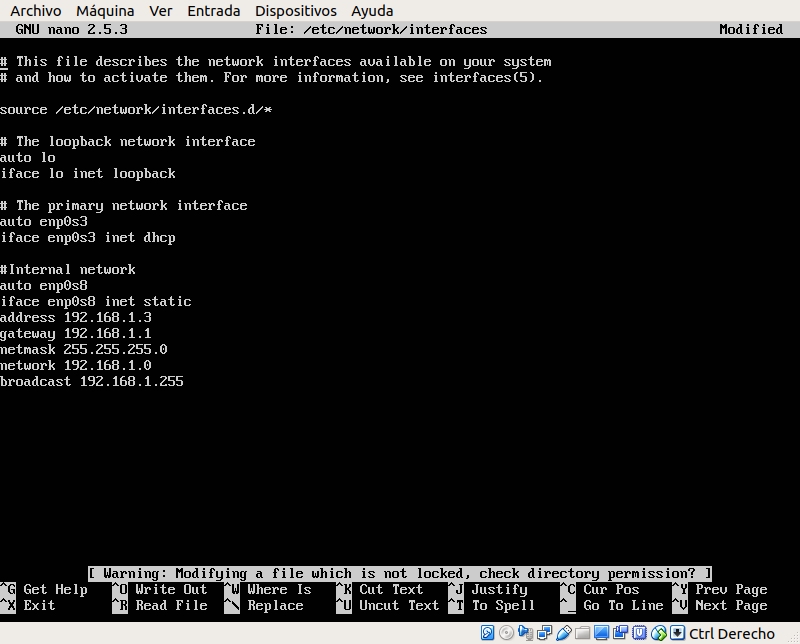
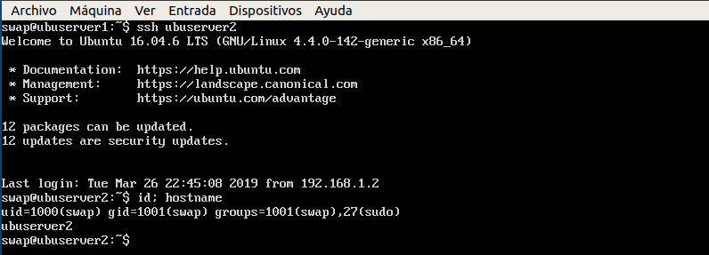

#Práctica 1. Preparación de las herramientas
Esta práctica consiste básicamente en la instalación de dos máquinas virtuales para que actúen como servidor web.

Para ello, he usado VirtualBox como medio de virtualización y Ubuntu Server 16.04 como sistema operativo. En dichas máquinas, he instalado OpenSSH Server y la pila LAMP que nos habilitará el servidor web y la base de datos de forma cómoda.

##Cuestiones a resolver
- Acceder por ssh de una máquina a otra.
- Acceder mediante la herramienta curl desde una máquina a la otra.

##Configuración de red
Tras la instalación de todas las herramientas necesarias, decidí modificar la configuración de red de NAT a red interna.

De esta forma, las máquinas quedarán comunicadas entre sí y no estarán en contacto con el exterior, algo que quedará solucionado posteriormente en la práctica 3 con la configuración de un balanceador de carga que hará de frontera.

Dicho esto, una vez seleccionado un adaptador de red interna en Virtualbox para ambas máquinas, modifico el archivo */etc/network/interfaces* para dar un dirección IP estática y configurar la nueva interfaz.

 Para la máquina 1 (ubuserver1) :
  
 
 Para la máquina 2 (ubuserver2) :
  
 
 Por tanto la red queda así:

| 		     |ubuserver1|ubuserver2|
|----------------|----------------|---------------|
| Red interna| 192.168.1.2|192.168.1.3|

Adicionalmente y por comodidad, he modificado el archivo */etc/hosts* para poder referirnos a cada máquina por su hostname y no tener que estar indicando la dirección IP en cada momento.

##Acceder por ssh de una máquina a otra
Primero vamos a probar la conectividad de ubuserver1 a ubuserver2, para ello hacemos usamos el comando ssh e indicamos la contraseña:

 

Repetimos el proceso desde ubuserver2:

 

##Acceder mediante la herramienta curl
Desde la máquina 1:

 

Desde la máquina 2:

 