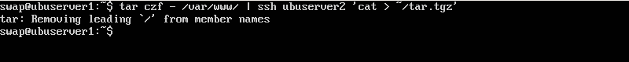
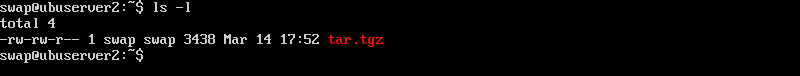
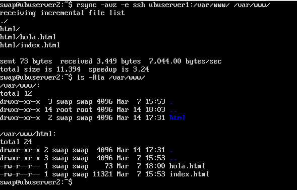
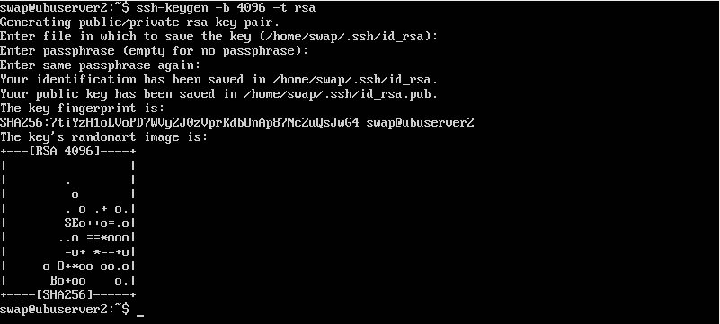
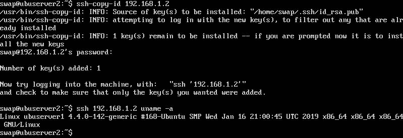
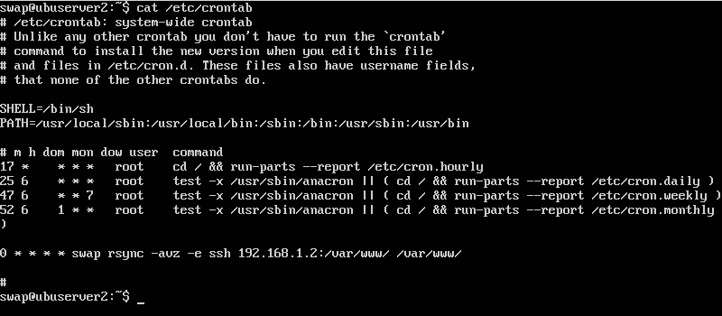

# Práctica 2. Clonar la información de un sitio web

En esta práctica los objetivos son:

- Aprender a copiar archivos de forma simple mediante ssh.
- Configurar las máquinas para trabajar en modo espejo de forma que la máquina secundaria mantenga siempre actualizada la información que hay en la máquina principal.
- Configurar ssh para acceder a las máquinas de forma remota sin contraseña.
- Establecer tareas usando el demonio cron.

## Transimisión de archivos a un equipo remoto

Si queremos copiar un directorio, por ejemplo el raíz de nuestro sitio web, podríamos hacer lo siguiente:
	
	tar czf - /var/www | ssh ubuserver2 'cat > ~/tar.tgz'

Primero comprimimos el directorio */var/www* y lo redirigimos como entrada para el comando ssh que realiza la conexión a la máquina remota. El comando entrecomillado a continuación del comando ssh se ejecuta en la máquina remota y redirige la salida del comando tar al archivo *tar.gz* en el directorio home de la máquina remota.

Comprobamos que, efecticamente el archivo está en el lugar esperado.

 

## Clonado de una carpeta usando *rsync*

La herramineta *rsync* nos permite clonar una carpeta cualquiera, en nuestro caso, clonaremos el directorio raíz del servidor web de la máquina principal desde la máquina secundaria.

Para no tener problemas, usaremos el mismo usuario (*swap*) en las dos máquinas y cambiaremos el grupo y el dueño del directorio web en la máquina principal a dicho usuario:
	
	sudo chown swap:swap -R /var/www
	
Esto es debido a que los ficheros y directorios mantienen los permisos y dueño tras ser copiados.

Para realizar la tarea y clonar el directorio, ejecutamos el siguiente comando:

	rsync -avz -e ssh ubuserver1:/var/www /var/www

 

En nuestro caso el comando es muy simple pero *rsync* nos permite personalizar el comando y especificar que ficheros copiar, cuáles ignorar, etc..

	--delete                delete extraneous files from dest dirs
	--exclude=PATTERN       exclude files matching PATTERN
	--include=PATTERN       don't exclude files matching PATTERN
	
## Acceso sin contraseña para ssh
Para facilitar la tarea de clonado usando *rsync*, ya que idealmente se tiene que ejecutar de forma automática mediante scripts, no nos podemos permitir tener que ir tecleando contraseñas. Para solucionar esto, usaremos autenticación con un par de claves pública-privada.
 
 Para generar el par de claves usamos el comando *ssh-keygen*. En este caso, usaremos claves de tipo rsa.

En nuestro caso, como queremos acceso sin contraseña, cuando nos pide el *passphrase* no teclearemos nada.
 
 

Después de generar las claves, deberemos copiar la clave pública a la máquina principal. Usaremos el comando *ssh-copy-id*.
 
  

Como podemos ver, nos hemos conectado a la máquina principal, hemos ejecutado un comando y no nos ha pedido contraseña.

## Programar tareas con crontab
cron es un administrador de tareas en segundo plano, también llamado demonio, que ejecuta procesos en el instante que le indiquemos.

Esta herramienta se ejecuta en segundo plano y consulta cada minuto el fichero */etc/crontab*, ejecutando las tareas que hayamos programado en dicho archivo.

Este archivo sigue una sintaxis compuesta por siete campos: minuto, hora, dia del mes, mes, dia de la semana, usuario y comando.

En nuestro caso, programaremos el clonado del directorio web que hemos aprendido a hacer usando el comando *rsync*.

Según esta configuración, cron ejecutará cada hora el comando de clonado y nos permitirá mantener la máquina secundaria actualizada.