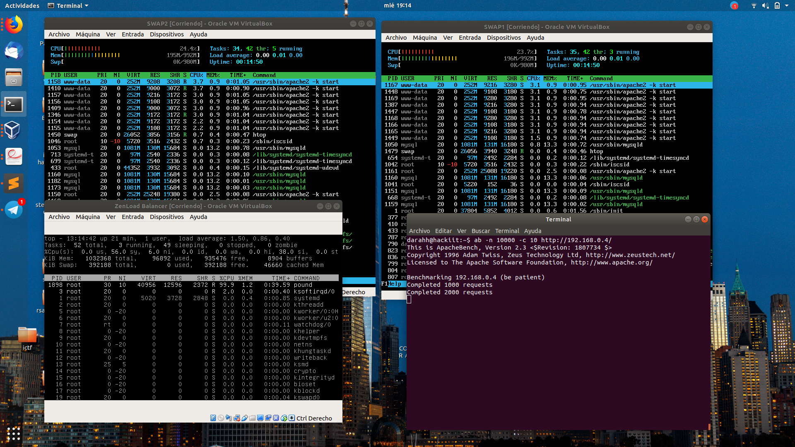

# Práctica 3. Balanceo de carga.

Los objetivos de esta práctica son:

- Instalar y configurar NGINX como balanceador de carga.
- Instalar y configurar haproxy como balanceador de carga.
- Someter la granja web a una alta carga haciendo uso de Apache Benchmark.

Adicionalmente, como tarea opcional, he instalado y configurado un tercer balanceador de carga, ZenLoad Balancer.

## Topología de red

En esta práctica, los servidores finales mantendrá la configuración de red de las anteriores prácticas y añadiré 3 balanceadores a la red interna. Además, dichos balanceadores estarán conectados al anfitrión mediante una interfaz Host-Only para poder realizar las pruebas de carga. La topología resultante es esta:

 

## Balanceo de carga usando nginx

Aunque nginx no es un balanceador de forma nativa ya que es un servidor web. Sin embargo, lo podemos configurar para que actúe como un balanceador. Para ello, tenemos que modificar el fichero de configuración `/etc/nginx/conf.d/default.conf`.

 

Una vez, modificado el fichero, reiniciamos le servicio y nginx debería trabajar como un balanceador. Si no funciona, habrá que comentar la línea `include /etc/nginx/sites-enabled/*` del fichero de configuración `/etc/nginx/nginx.conf`.

Para probar el balanceo de carga, podemos usar el programa Apache Benchmark:

	ab -n 10000 -c 10 http://192.168.0.2/

	darahh@hackiit:~$ ab -n 10000 -c 10 http://192.168.0.2/
	This is ApacheBench, Version 2.3 <$Revision: 1807734 $>
	Copyright 1996 Adam Twiss, Zeus Technology Ltd, http://www.zeustech.net/
	Licensed to The Apache Software Foundation, http://www.apache.org/

	Benchmarking 192.168.0.2 (be patient)
	Completed 1000 requests
	Completed 2000 requests
	Completed 3000 requests
	Completed 4000 requests
	Completed 5000 requests
	Completed 6000 requests
	Completed 7000 requests
	Completed 8000 requests
	Completed 9000 requests
	Completed 10000 requests
	Finished 10000 requests

	Server Software:        nginx/1.10.3
	Server Hostname:        192.168.0.2
	Server Port:            80

	Document Path:          /
	Document Length:        11321 bytes

	Concurrency Level:      10
	Time taken for tests:   10.984 seconds
	Complete requests:      10000
	Failed requests:        0
	Total transferred:      115940000 bytes
	HTML transferred:       113210000 bytes
	Requests per second:    910.38 [#/sec] (mean)
	Time per request:       10.984 [ms] (mean)
	Time per request:       1.098 [ms] (mean, across all concurrent requests)
	Transfer rate:          10307.53 [Kbytes/sec] received

	Connection Times (ms)
		      min  mean[+/-sd] median   max
	Connect:        0    0   0.2      0       7
	Processing:     3   11   1.8     11      33
	Waiting:        2   10   1.7     10      32
	Total:          3   11   1.8     11      33

	Percentage of the requests served within a certain time (ms)
	  50%     11
	  66%     11
	  75%     11
	  80%     12
	  90%     13
	  95%     14
	  98%     16
	  99%     18
	 100%     33 (longest request)

Adicionalmente, se puede modificar la configuración para que el balanceador no reparta la carga de forma equitativa, útil si una máquina es más potente que otra:

En el uso de la CPU se puede ver como al servidor `192.168.1.2` se le ha repartido más carga que al servidor `192.168.1.3`.

## Balanceo de carga con haproxy

Haproxy es un balanceador de carga y proxy, su configuración es sencilla y dispone de muchas opciones para realizar cualquier tipo de balanceo.

Tras la instalación, modificaremos el fichero de configuración `/etc/haproxy/haproxy.cfg` con la siguiente configuración:

Para probar que funciona correctamente, usamos la misma orden que con nginx:

	ab -n 10000 -c 10 http://192.168.0.3/

Los resultados del benchmark son:

	darahh@hackiit:~$ ab -n 10000 -c 10 http://192.168.0.3/
	This is ApacheBench, Version 2.3 <$Revision: 1807734 $>
	Copyright 1996 Adam Twiss, Zeus Technology Ltd, http://www.zeustech.net/
	Licensed to The Apache Software Foundation, http://www.apache.org/

	Benchmarking 192.168.0.3 (be patient)
	Completed 1000 requests
	Completed 2000 requests
	Completed 3000 requests
	Completed 4000 requests
	Completed 5000 requests
	Completed 6000 requests
	Completed 7000 requests
	Completed 8000 requests
	Completed 9000 requests
	Completed 10000 requests
	Finished 10000 requests

	Server Software:        Apache/2.4.18
	Server Hostname:        192.168.0.3
	Server Port:            80

	Document Path:          /
	Document Length:        11321 bytes

	Concurrency Level:      10
	Time taken for tests:   10.990 seconds
	Complete requests:      10000
	Failed requests:        0
	Total transferred:      115950000 bytes
	HTML transferred:       113210000 bytes
	Requests per second:    909.90 [#/sec] (mean)
	Time per request:       10.990 [ms] (mean)
	Time per request:       1.099 [ms] (mean, across all concurrent requests)
	Transfer rate:          10303.01 [Kbytes/sec] received

	Connection Times (ms)
		      min  mean[+/-sd] median   max
	Connect:        0    0   0.3      0       7
	Processing:     1   11   3.6     10      61
	Waiting:        1   10   3.5     10      61
	Total:          1   11   3.6     10      62

	Percentage of the requests served within a certain time (ms)
	  50%     10
	  66%     11
	  75%     12
	  80%     13
	  90%     15
	  95%     17
	  98%     21
	  99%     24
	 100%     62 (longest request)

## Tarea Opcional: ZenLoad Balancer

Para esta parte decidí instalar y configurar ZenLoad Balancer porque se habló de él en clase de teoría y he de decir que la instalación y configuración inicial de la máquina fue algo tediosa, por no decir que los enlaces de descarga de la página oficial estaban caídos.

La configuración del balanceo de carga fue algo más sencilla, aunque la interfaz web me parece innecesaria.

Lo primero que hice fue configurar las interfaces de red sin hacer uso de la interfaz web, pero por motivos que desconozco la configuración se elimina tras reiniciar la máquina, por tanto, me ví obligado a configurarlo desde la interfaz web.

Después de configurar la red, hay que crear una granja en *Manage>Farms* indicando la IP, el puerto y HTTP como profile.

Tras esto, tenemo que añadir los servidores web finales a la granja que acabamos de crear, para ello editamos la granja y los añadimos en la sección *Service LB*

Una vez hecho esto, nuestro balanceador de carga debería funcionar correctamente, para probarlo volvemos a hacer uso de Apache Benchmark:

	ab -n 10000 -c 10 http://192.168.0.4/
	
No sé que algoritmo de balanceo implementa concretamente este balanceador pero a diferencia de los otros dos, al hacer pruebas con curl vi que las peticiones no se alternaban entre los servidores de forma continuada. Es decir, al hacer una petición y recibir la respuesta del servidor 1, por ejemplo, la siguiente petición no era atendida por el servidor 2 el 100% de las veces y volvía a responder el servidor 1, algo que no sucedía con los otros balanceadores.

Los resultados del benchmark son:

	darahh@hackiit:~$ ab -n 10000 -c 10 http://192.168.0.4/
	This is ApacheBench, Version 2.3 <$Revision: 1807734 $>
	Copyright 1996 Adam Twiss, Zeus Technology Ltd, http://www.zeustech.net/
	Licensed to The Apache Software Foundation, http://www.apache.org/

	Benchmarking 192.168.0.4 (be patient)
	Completed 1000 requests
	Completed 2000 requests
	Completed 3000 requests
	Completed 4000 requests
	Completed 5000 requests
	Completed 6000 requests
	Completed 7000 requests
	Completed 8000 requests
	Completed 9000 requests
	Completed 10000 requests
	Finished 10000 requests

	Server Software:        Apache/2.4.18
	Server Hostname:        192.168.0.4
	Server Port:            80

	Document Path:          /
	Document Length:        11321 bytes

	Concurrency Level:      10
	Time taken for tests:   12.182 seconds
	Complete requests:      10000
	Failed requests:        0
	Total transferred:      115950000 bytes
	HTML transferred:       113210000 bytes
	Requests per second:    820.85 [#/sec] (mean)
	Time per request:       12.182 [ms] (mean)
	Time per request:       1.218 [ms] (mean, across all concurrent requests)
	Transfer rate:          9294.69 [Kbytes/sec] received

	Connection Times (ms)
		      min  mean[+/-sd] median   max
	Connect:        0    0   0.2      0       6
	Processing:     1   12   5.4     11     184
	Waiting:        1    3   2.3      2      41
	Total:          2   12   5.4     11     184

	Percentage of the requests served within a certain time (ms)
	  50%     11
	  66%     13
	  75%     15
	  80%     16
	  90%     19
	  95%     22
	  98%     25
	  99%     28
	 100%    184 (longest request)
