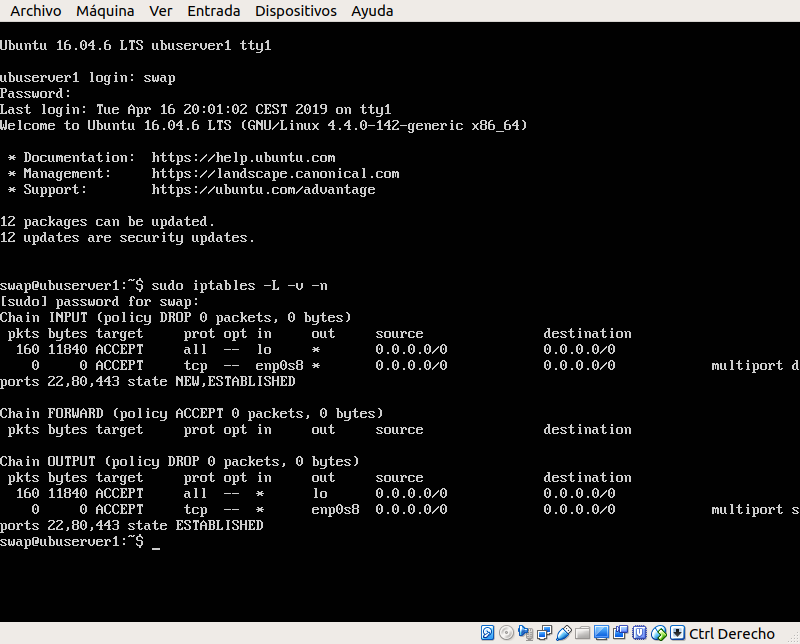

# Práctica 4. Asegurar la granja web.

Los objetivos de esta práctica son:

- Instalar un certificado SSL para configurar el acceso HTTPS a los servidores.
- Configurar las reglas del cortafuegos para proteger la granaja web.

## Instalar un certificado SSL autofirmado para configurar el acceso por HTTPS

Primero, tenemos que activar el módulo SSL de Apache y reiniciar el servidor:

 

Generamos los certificados en la ruta `/etc/apache2/ssl/` e indicamos una serie de datos que se nos pedirán para configurar el dominio.

	sudo openssl req -x509 -nodes -days 365 -newkey rsa:2048 -keyout /etc/apache2/ssl/apache.key -out /etc/apache2/ssl/apache.crt

Hay que modificar el fichero de configuración `/etc/apache2/sites-available/default-ssl`, concretamente las lineas referentes a la configuración de SSL:

	SSLCertificateFile /etc/apache2/ssl/apache.crt
	SSLCertificateKeyFile /etc/apache2/ssl/apache.key
	
 

Activamos *default-ssl* y reiniciamos el servidor:

	a2ensite default-ssl
	service apache2 reload
	
Para habilitar HTTPS en el segundo servidor, deberemos copiar el certificado y la key que hemos usado en el primer servidor y realizar la misma configuración.

 

En el caso del balanceador de carga, en este caso nginx, deberemos copiar el certificado y la key y modificar el archivo `/etc/nginx/conf.d/default.conf` y añadir lo siguiente:

	listen 443 ssl;
	ssl on;
	ssl_certificate /etc/ssl/apache.crt;
	ssl_certificate_key /etc/ssl/apache.key;

Ahora podremos hacer peticiones HTTPS al balanceador (192.168.0.2) y distribuirá la carga como hace normalmente con las peticiones HTTP:

 

## Configurar el cortafuegos

Para filtrar y bloquear el tráfico que llega a nuestras máquinas usamos *iptables*. En esta práctica crearemos un script con la configuración necesaria para un servidor web:

	#!/bin/bash
	#Eliminar todas las reglas
	iptables -F
	iptables -X
	iptables -Z
	iptables -t nat -F

	#Por defecto, denegar tood el tráfico
	iptables -P INPUT DROP
	iptables -P OUTPUT DROP

	#Permitir cualquier acceso desde localhost
	iptables -A INPUT -i lo -j ACCEPT
	iptables -A OUTPUT -o lo -j ACCEPT

	#Abrimos los puertos 22, 80, 443 para que nuestro servidor web de servicio
	iptables -A INPUT -i enp0s8 -p tcp -m multiport --dports 22,80,443 -m state --state NEW,ESTABLISHED -j ACCEPT
	iptables -A OUTPUT -o enp0s8 -p tcp -m multiport --sports 22,80,443 -m state --state ESTABLISHED -j ACCEPT

Para que el script se ejecute en el arranque del sistema lo que he hecho es planificarlo como una tarea en crontab de la siguiente forma:

De esta forma, cada vez que se inicia el sistema, se ejecutará el script que configura el firewall.

	
