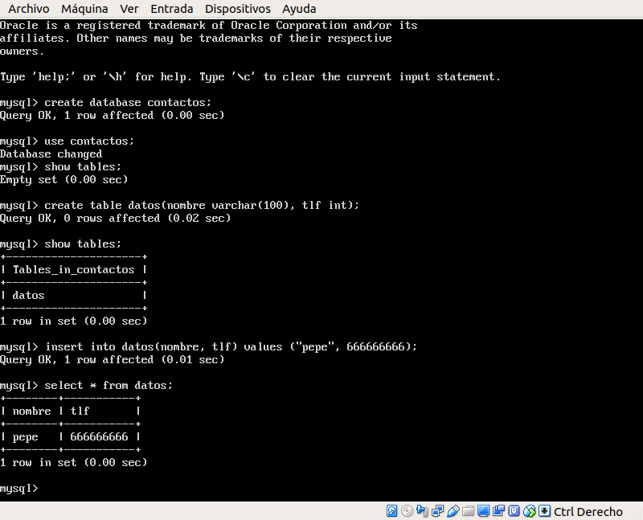
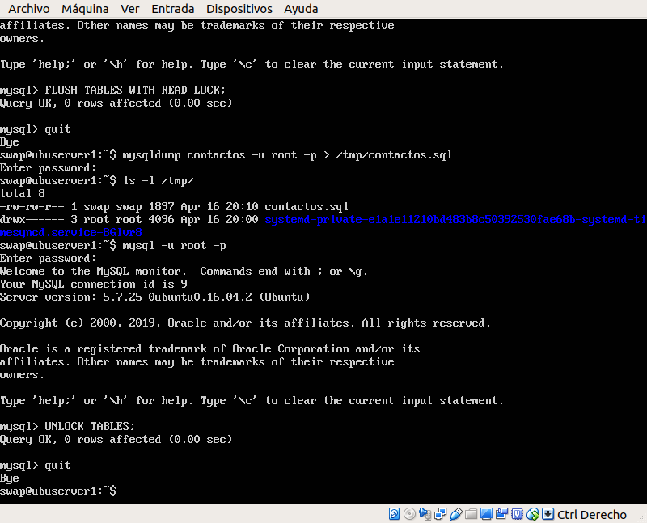
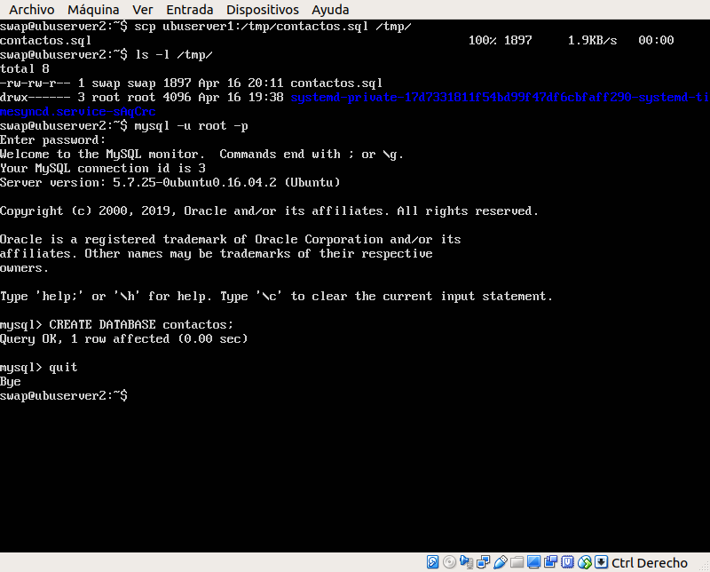
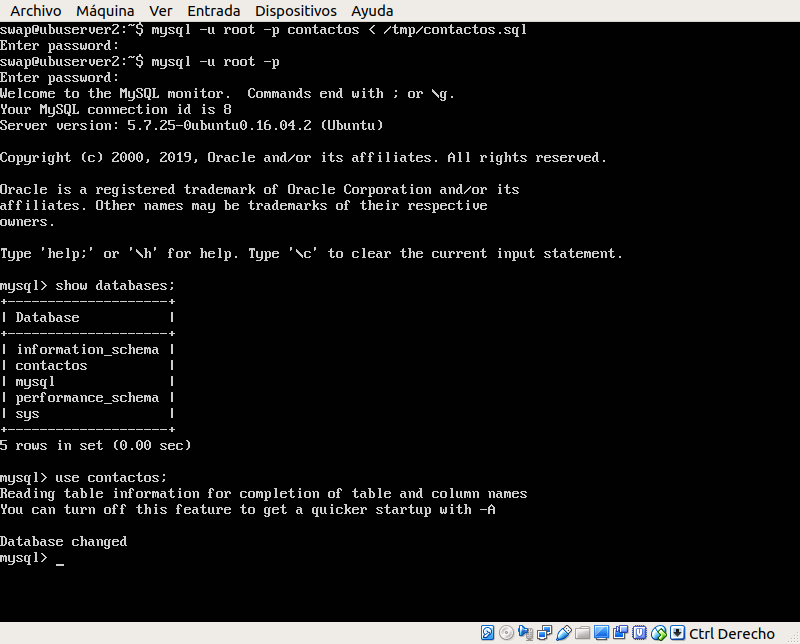
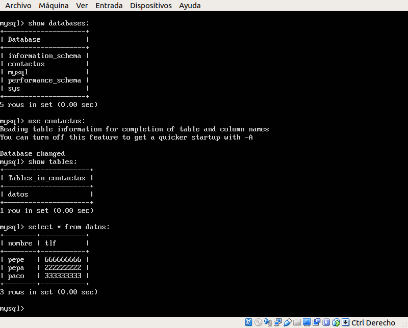
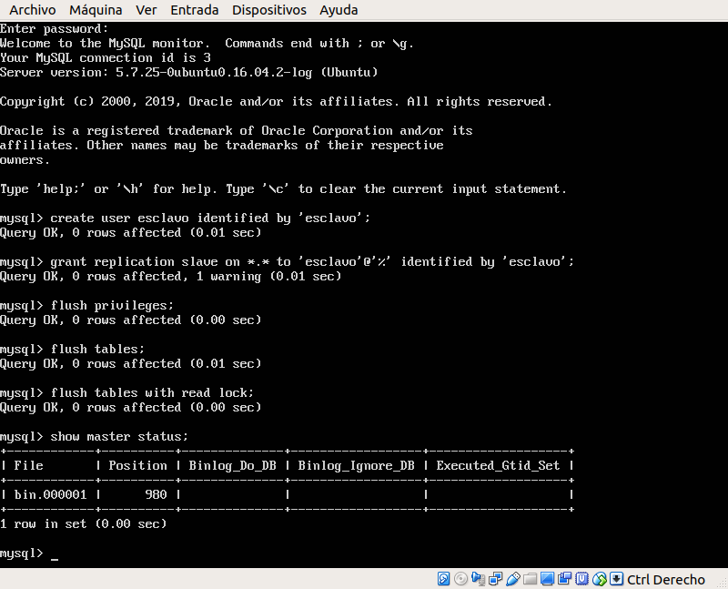
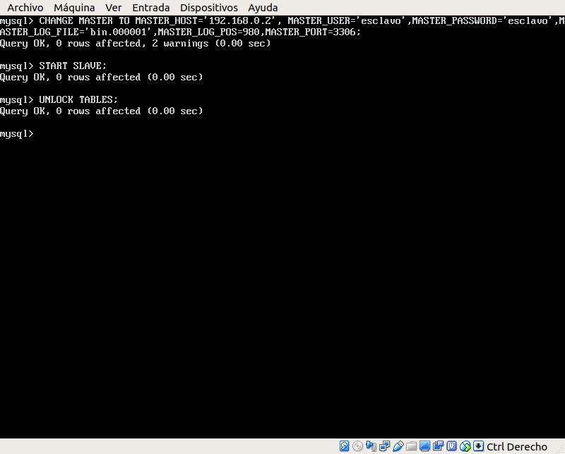
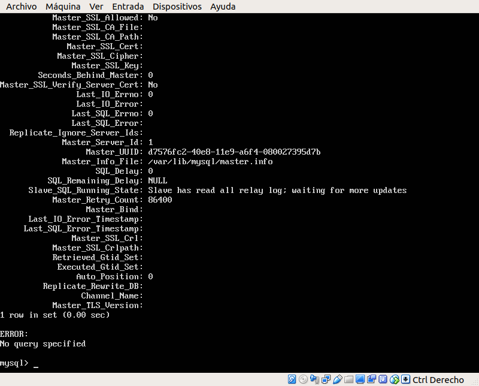
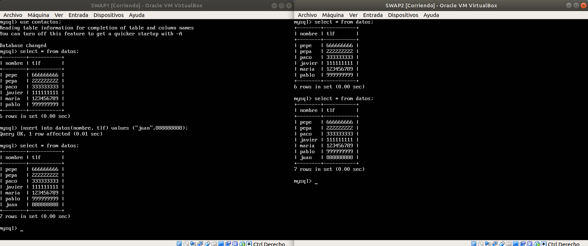
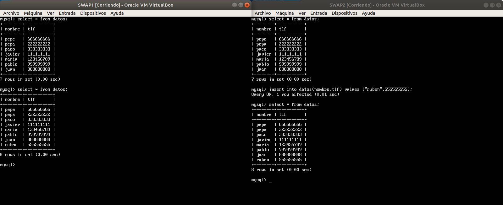

# Práctica 5. Replicación de bases de datos MySQL

Los objetivos de esta práctica son:

- Copiar archivos de copia de seguridad mediante ssh.
- Clonar manualmente BD entre máquinas.
- Configurar la estructura maestro-esclavo entre dos máquinas.
- Adicionalmente, configurar la estructura maestro-maestro.

## Crear una BD e insertar datos

Para empezar, crearemos una base de datos en el servidor 1 e insertaremos unos cuantos datos para, posteriormente, probar las copias de seguridad.

## Replicar una BD MySQL con mysqldump

La herramienta *mysqldump* nos permite clonar la BD que tenemos en el servidor 1 para transferir dichos datos a otro servidor SQL.

En el servidor 1 haremos lo siguiente:

 

Ahora lo transmitimos al servidor 2 para proceder a clonar los datos y creamos la base de datos en la que se copiarán las tablas:

 

Le pasamos al cliente *mysql* el fichero que hemos creado y que contiene las sentencias necesarias para crear las tablas:

Comprobamos que los datos se han clonado correctamente:

## Replicar mediante una configuración maestro-esclavo

Para realizar esta configuración deberemos configurar lo siguiente de igual forma en el servidor maestro y en el esclavo, modificando el archivo `/etc/mysql/mysql.conf.d/mysqld.conf`:

Deberemos comentar la linea:
	
	#bind-address 127.0.0.1
	
Modificar la ruta de los archivos del log de errores y del registro de modificaciones:

	log_error = /var/log/mysql/error.log
	log_bin = /var/log/mysql/bin.log
	
Establecemos el identificador del servidor (1 para maestro, 2 para esclavo).

	server-id= 1
	
Finalmente, reiniciamos el servicio *mysql*.

Ahora, en la máquina maestro crearemos un usuario y le daremos permisos para que se pueda llevar a cabo el clonado.

Después, en la máquina esclavo escribimos los siguientes comandos, que básicamente indican qué máquina es la maestro y arranca el esclavo.

Si no recibimos ningún aviso de error, la configuración se debe haber habilitado correctamente.

Para configurar el funcionamiento, insertamos datos en la máquina maestro y vemos como se actualiza en la máquina esclavo.

## Replicar mediante una configuración maestro-maestro

Para esta estructura, realizaremos la configuración aplicada al servidor 1 en el servidor 2 y viceversa. 

Una vez que hemos repetido el proceso anteriormente explicado, podemos comprobar su funcionamiento insertando datos en el servidor 2 y viendo como se actualiza en el servidor 1.

