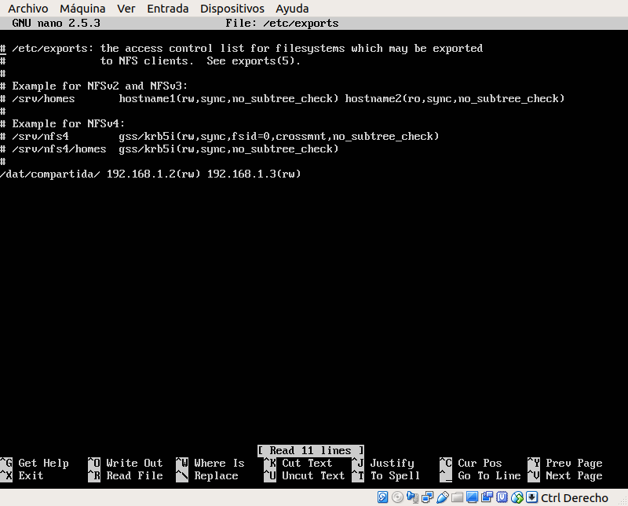
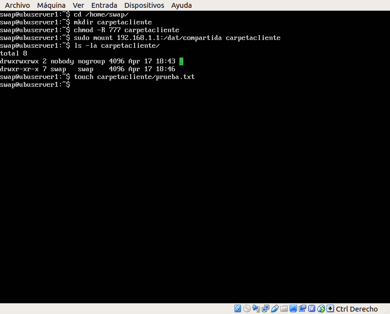
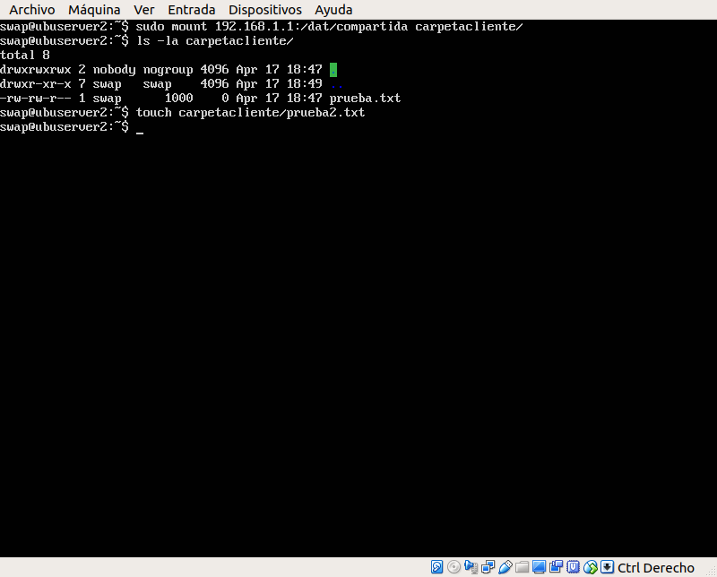
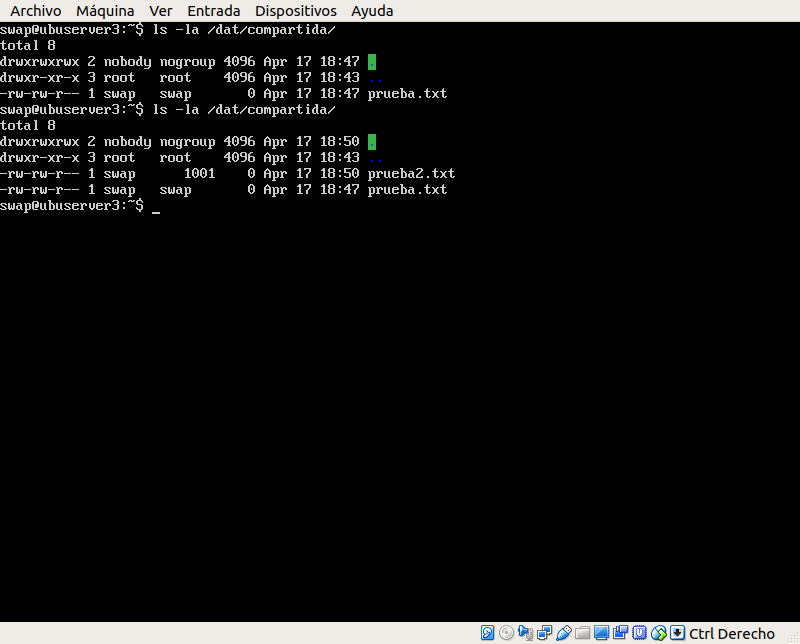
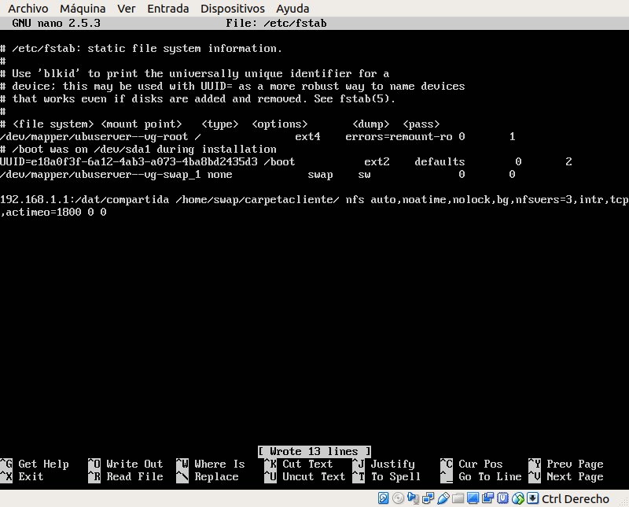

# Práctica 6. Servidor de disco NFS

Los objetivos de esta práctica son:

- Configurar una máquina como servidor de disco NFS.
- Montar en las máquinas clientes la carpeta exportada por el servidor.
- Comprobar que la información que se escribe en la carpeta se ve actualizada en el resto de máquinas.

## Configurar el servidor NFS

En la máquina servidora, en mi caso será la máquina en la que uso nginx como balanceador, instalamos las herramientas necesarias:

	sudo apt-get install nfs-kernel-server nfs-common rpcbind
	
Ahora, creamos la carpeta que usaremos como espacio compartido y cambiamos el propietario y los permisos de la carpeta:

	mkdir /dat/compartida
	sudo chown nobody:nogroup /dat/compartida/
	sudo chmod -R 777 /dat/compartida/
	
Para permitir que las máquinas clientes tengan acceso a dicha carpeta modificaremos el fichero `/etc/exports` añadiendo la siguiente linea:

	/dat/compartida/ 192.168.1.2(rw) 192.168.1.3(rw)
	
 
	
Finalmente, reiniciamos el servicio:

	sudo service nfs-kernel-server restart
	
## Configurar los clientes

En los clientes instalaremos los clientes necesarios y crearemos el punto de montaje:

Para comprobar que todo funciona correctamente, crearemos un archivo en la carpeta desde cada cliente y veremos si se actualiza en las demás máquinas.

Montamos la carpeta en el servidor 2 y vemos que el fichero creado en el servidor 1 es accesible desde otra máquina.

Por otro lado, creamos un archivo desde el servidor 2 y comprobamos que vemos la carpeta actualizada desde el servidor 1.

## Montar las carpetas compartidas en el arranque

Por último, para hacer la configuración permanente, debemos añadir una línea a archivo de configuración `/etc/fstab` de ambas máquinas clientes, de esta forma la carpeta compartida se montará al arrancar el sistema.

