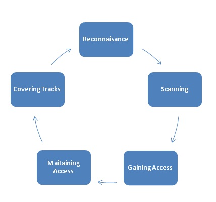

# Tests de intrusión

## Introducción

Un **test de intrusión** o examen de penetración, popularmente conocido como **pentest**, es un ataque a un sistema informático realizado con la intención de evaluar el nivel de seguridad de dicho sistema informático, es decir, identificar las debilidades, también conocidas como vulnerabilidades, conocer el riesgo de que entidades no autorizadas obtengan acceso a las características y datos del sistema, así como conocer también las fortalezas, lo que nos permite realizar un **informe de riesgos** completo.

Generalmente, el proceso consiste en identificar los sistemas que se tienen como objetivo, recopilar toda la información disponible y adoptar diferentes formas de alcanzar un objetivo en particular. 

El pentesting es una práctica totalmente legal siempre que realicemos los ataques hacia nuestros propios equipos o equipos dentro del ámbito proporcionado por nuestros clientes, con el debido consentimiento.

Podríamos decir que existen tres tipos de pentests:
	
- Caja negra. Cuando el personal que ejecuta los ataques no ha sido proporcionado conocimiento previo sobre el sistema, sus características o funcionamiento interno.
- Caja blanca. Cuando el personal atacante dispone de un conocimiento detallado del funcionamiento y características del sistema, arquitectura de red...
- Caja Gris. Es una combinación de los dos anteriores. Simula la posición de alguien que tiene cierto conocimiento del sistema pero que no tiene privilegios elevados, como por ejemplo podría ser un empleado.

El escenario más normal suele ser el pentest de caja negra ya que lo que más interesa a clientes es estar protegido desde el punto de vista de un atacante externo. Un test de intrusión ayuda a determinar si sus sistemas son vulnerables o si las defensas (si las hubiera) son suficientes y no fueron sobrepasadas. 

Un término que se suele confundir con test de intrusión es el de **auditoría**. Un test de intrusión suele formar parte de una auditoría de seguridad completa, que es un proceso compuesto por otras fases.

Otro término comúnmente confundido suele ser el de **RED team**. Es un término que se refiere a un grupo u organización que actúa y emula las acciones (desde un punto de vista ofensivo) de un posible adversario del mundo real. Es un término de origen militar adoptado en simulacros de maniobras militares.

Cuando es usado en el ámbito de la seguridad de la información, normalmente es un grupo de expertos *white-hat* que atacan una infraestructira digital como haría un adversario real. La línea que separa *pentest* del red teaming es bastante delgada en la práctica aunque hay algunas diferencias:

- La duración. Las actividades de un red team suelen llevarse a cabo en campañas más largas que duran semanas, meses o incluso años. Por otro lado, un pentest no suele durar más de 2 semanas.
- *Multi-domain*. Las actividades de un red team se realizan tanto en el ámbito digital como en el físico y social.
- "Calidad" de la simulación. Un pentest suele ser menos personalizado y se basa en lanzar una serie de herramientas al sistema en cuestión, por otro lado, un red team se suele adaptar a la situación que le proponga el sistema que haya atacar por lo que ofrece un servicio más personalizado y una simulación más precisa.

## Historia

A mediados de la década de los 60, el uso de los sistemas informáticos de tiempo compartido accesibles a través de líneas de comunicación telefónica creó nuevas preocupaciones de seguridad. 

Fue en 1965 cuando varios de los principales expertos en seguridad informática celebraron una de las primeras grandes conferencias sobre seguridad de sistemas, organizada por la System Development Corporation (SDC), contratista del gobierno de los Estados Unidos. Durante la congreso, se observó que un empleado de la SDC había sido capaz de evadir fácilmente las protecciones añadidas al sistema informático de tiempo compartido AN/FSQ-32 de la SDC. 

De este modelo de computadoras solo fueron manufacturadas dos unidades, la otra estaba en manos de la Agencia Central de Inteligencia de los Estados Unidos y evidentemente la preocupación creció a causa de este suceso. 

Fue entonces cuando los asistentes pidieron que se realizaran estudios sobre cómo romper las protecciones de seguridad en el sistema de tiempo compartido, lo que se convirtió en una de las primeras peticiones formales para usar la intrusión y la evasión de protecciones como una herramienta para el estudio y mejora de la seguridad de los sistemas.

La amenaza que la penetración de computadoras planteaba, fue delineada en un importante reporte organizado por el Departamento de Defensa de los Estados Unidos de América (DoD) a fines de 1967. En esencia, funcionarios del Departamento de Defensa recurrieron a Willis Ware, experto en seguridad, para dirigir un grupo de trabajo de expertos de la NSA, la CIA, el DoD, la academia y la industria para evaluar formalmente la seguridad de los sistemas informáticos de tiempo compartido remotamente accesibles.

Para tener una mejor comprensión de las debilidades del sistema, el gobierno federal y sus contratistas pronto comenzaron a organizar equipos de penetradores, conocidos como equipo tigre,13​ para utilizar la penetración de computadoras "pentesting" como medio para la seguridad del sistema de prueba. Deborah Russell y GT Gangemi, declararon que durante la década de 1970 los equipos tigre aparecieron por primera vez.

## Metodologías y fases

A la hora de realizar estas pruebas de seguridad es importante seguir un orden en nuestras acciones y tener en cuenta ciertos criterios que nos permitan adaptarnos de la mejor forma a la situación y al sistema que se nos propone. 

Para conseguir esto, se ha  definido diferentes metodologías que dotan de rigor y formalidad al proceso para orientar al pentester y ayudarle a mejorar las técnicas y los resultados.

En general, existen fases genéricas aunque luega cada metodología extendiende unas o añade fases nuevas. Son las cinco siguientes: **reconocimiento**, **escaneo y análisis de vulnerabilidades**, **obtención de acceso y escalada de privilegios**, **persistencia** y **eliminación del rastro de la intrusión**.

 

Las metodologías más popularizadas son OWASP, PTES, ISSAF, OSSTMM y cada una se aplica a una situación concreta en la que dicha metodología es ideal aplicar.

##### OWASP
Método de testing para aplicaiones web que se basa en dos fases, pasiva y activa. Sigue un enfoque de *black box* y es una metodología abierta y colaborativa.

- Fase pasiva: Consiste en el conjunto de pruebas que permiten comprender la lógica de la aplicación.
- Fase activa: Se prueban todos los procesos recomendados en esta metodología. Son 9 categorías y unos 66 procesos:
	- Configuration Management Testing (Information gathering + configuration management).
	- Authentication Testing
	- Authorization testing
	- Session Management Testing
	- Business Logic Testing
	- Data Validation Testing
	- Denial of Service Testing
	- Web Services Testing
	- Ajax Testing

##### PTES
Penetration Testing Execution Standart es una metodología que consta de siete fases o secciones. Está pensada para determinar los niveles de riesgo y poder dirigirlos a un lenguaje sencillo para facilitar la comunicación con el cliente.

- Herramientas requeridas
- Recolección de información
- Análisis de vulnerabilidades
- Explotación
- Post-explotación
- Informes

##### OSSTMM

Open Source Security Testing Methodology Manual es una metodología para probar la seguridad operativa de ubicaciones físicas, flujo de trabajo, pruebas de seguridad humana, pruebas de seguridad física, pruebas de seguridad inalámbrica, pruebas de seguridad de telecomunicaciones, pruebas de seguridad de redes de datos y cumplimiento.

Es una de las metodologías más estrictas y sus objetivos son:

- Aumentar la rigurosidad de las pruebas
- Evitar falso positivos
- Cumplir con regulaciones
- Cuantificar los resultados
- Obtener resultados consistentes
- Realizar una auditoria formal de calidad

## Certificaciones

La realización de un test de intrusión es una tarea altamente técnica que también requiere una adecuada conducta ética y unas habilidades excelentes de comunicación escrita a través de informes. Aunque muchos de los profesionales se convierten en pentesters de forma autodidacta, tener un abanico de habilidades puede no ser suficiente para asegurarnos un trabajo. Por esto sucede, que para la gran mayoría de las empresas sea necesario algún tipo de certificación que nos proporcione un contexto más o menos sólido.

Existen numerosas certificaciones como pueden ser GPEN, GCIH, GXPN, LPT... Pero en este caso me centraré en, desde mi punto de vista, las dos más populares:

##### Certified Ethical Hacker (CEH)

Es un certificado gestionado por el EC-Council que demuestra diferentes habilidades relacionadas con la seguridad de la información y *e-business*.

- Realizar escaneos de redes para encontrar máquinas vulnerables. 
- Conocimiento de vectores de ataque.
- Realizar enumeración de SO, servicios y usuarios. 
- Realizar sniffing de tráfico de red.
- Identificar y usar virus, gusanos y otros malware para explotar sistemas.
- Manejar un abanico de servidores web y vectores de ataque de aplicaciones web como directory traversal, XSS, parameter tampering...
- Realizar diferentes ataques criptográficos.
- Realizar análisis de vulnerabilidades para identificar posibles problemas en la red de la organización y en la infraestructura de comunicación.
- Realizar inyecciones SQL.

##### Offensive Security Certified Professional (OSCP)

OSCP garantiza que aquella personas que la aprueban son capaces de identificar vulnerabilidades de distinta naturaleza, crear y modificar exploits para hacerlos funcionar y tomar control total del sistema (escalada de privilegios y mantener el acceso) en una gran variedad de sistemas operativos. [Temas recogidos por OSCP](https://www.offensive-security.com/documentation/penetration-testing-with-kali.pdf).

No es necesario renovar la certificación.

En el examen te proporcionan las IPs de 5 máquinas las cuales tienes que obtener acceso en un máximo de 24 horas y otras 24 horas para escribir y enviar el informe con tus resultados. Dependiendo de la máquina y del tipo de acceso que consigas (con privilegios root/system o no) obtendrás más o menos puntos. Necesitas al menos 70 puntos para aprobar de un total de 100.

El uso de Metasploit está bastante limitado y usar herramientas automatizadas como Nessus o sqlmap, etc. no está permitido.
